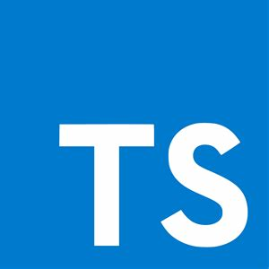

# Formation Typescript

Dans cette formation vous apprendrez les bases du langage de programmation typescript.

## Le plan

1. [À propos de typescript](./assets/cours/about.md)
2. [Les variables & les types](./assets/cours/variables.md)
3. [Les tableaux](./assets/cours/array.md)
4. [Les objets](./assets/cours/objects.md)
5. [Créer ses propres types](./assets/cours/create-types.md)
6. [Les fonctions](./assets/cours/functions.md)
7. [Les génériques](./assets/cours/generics.md)
8. [React & Le JSX](./assets/cours/jsx.md)
9. [La programmation orientée objet](./assets/cours/poo.md)
