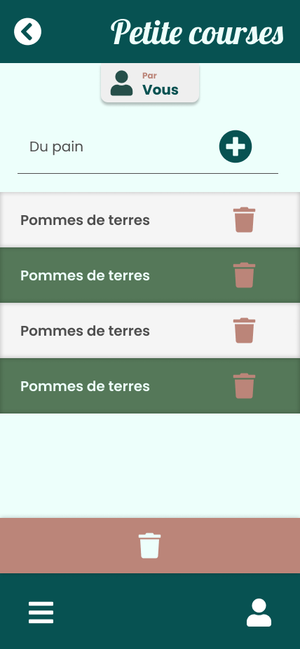

# Exercice TODO List

Dans cette exercice, il est demandé de développer le code nescessaire au développement de la page todo list :



## Installer l'application

Il vous suffit de la télécharger ou cloner, puis dans un terminal lancer :

```bash
npm i
npm start
```

> Il vous faudra expo go d'installer afin de pouvoir tester sur un téléphone
