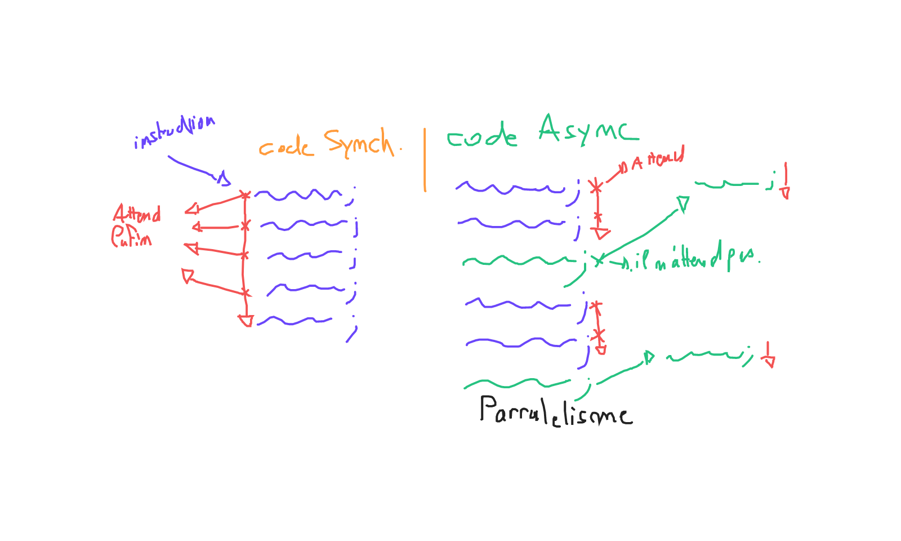

# L'asynchrone

Il éxiste des fonctions en javascript et/ou typescript qui sont dite Asynchrone. C'est à dire qu'elle sont non bloquante (elles peuvent s'éxécuter en même temps que d'autre instruction).

## Schèma



## Prenons un exemple

Voici un éxemple de fonction dite synchrone :

```tsx
function additionner(x: number, y: number): number {
  return x + y
}

// Chaque fonction est bloquante. C'est à dire que l'on doit
// attendre la fin de la fonction pour passer à la ligne suivante
additionner(3, 5)
additionner(10, 8)
additionner(3, 5)
additionner(10, 8)
additionner(3, 5)
additionner(10, 8)
additionner(3, 5)
additionner(10, 8)
```

Les fonctions non bloquante utilise un petit mot clef : `async` (devant le mot clef fonction). Ces dernières n'attende pas qu'elle se termine :

```tsx
async function additionner(x: number, y: number) {
  return x + y
}

// Chaque fonction est non bloquante. C'est à dire que toutes les fonctions
// s'éxécute en même temps
additionner(3, 5)
additionner(10, 8)
additionner(3, 5)
additionner(10, 8)
additionner(3, 5)
additionner(10, 8)
additionner(3, 5)
additionner(10, 8)

// On peut aussi faire des fonctions fléché asynchrone :
const sub = async (x: number, y: number) => x - y
```

## Promise (Promesse)

Etant donné qu'une fonction asynchrone n'attend pas qu'elle se termine. Il est donc impossible de récupérer le résultat de la fonction :

Fonction Synchrone :

```tsx
function additionner(x: number, y: number): number {
  return x + y
}

const result = additionner(3, 5)

console.log(result) // 8
```

Fonction Asynchrone :

```tsx
async function additionner(x: number, y: number) {
  return x + y
}

const result = additionner(3, 5)

console.log(result) // Promise<number>
```

Il éxiste un type très particulier : `Promise`. Ce type est utilisé comme retour des fonction asynchrone. Il permet de symboliser le fait que la fonction est en train de s'éxécuter en parraléle et que le résultat est "promis".

Il est possible de manipuler une `Promise` en utilisant 2 opérations :

- L'opération `then` : C'est une callback se lancant dès que notre promesse à terminé
- L'opération `catch` : C'est une callback se lancant si notre fonction à échoué

Exemple d'utilisation de `then` et `catch` :

```tsx
async function additionner(x: number, y: number) {
  return x + y
}

const promise = additionner(3, 5)

promise
  // Cette opération recoit une fonction qui se déclenchera
  // lorsque la promesse est terminé
  .then(result => console.log(result))
  // Cette opérationc reçoit une fonction qui se déclenchera
  // lorsque la promesse à échoué
  .catch(err => console.error(err))
```

Il est possible de typer une promesse :

```tsx
async function additionner(x: number, y: number): Promise<number> {
  return x + y
}
```

## Le mot `await`

Il est possible dans une fonction asynchrone, d'attendre le résultat d'une promesse en utilisant le mot clé `await` :

```tsx
async function additionner(x: number, y: number): Promise<number> {
  return x + y
}

async function main() {
  const promise = additionner(5, 2) // Promise<number>

  // Il est possible de récupérer le résultat directement
  // en utilisant await :
  const result = await additioner(10, 5) // 15
}
```

> **IMPORTANT** : On ne peut utiliser await **que dans une fonction asynchrone** !!!!

## Utilisation avancé : Créer ses propres promesses

Il est possible de créer ses propres promesse en utilisant le constructeur de `Promise`. Ce constructeur reçoit une fonction accéptant 2 autres fonctions : `resolve` et `reject`.

Exemple :

```js
/**
 * Création d'un fonction qui attend un nombre de milliseconde donné
 */
function wait(ms: number): Promise<void> {
  // Je créer une promesse "à la main" :
  const promise = new Promise(
    // Pour créer une promesse nous envoyons une fonction
    (resolve, reject) => {
      // La paramètre resolve est une fonction qui permet d'indiquer
      // quand est-ce que la promesse se termine tandis que le reject
      // indique une erreur.

      // Créer un timeout
      window.setTimeout(() => {
        // Ici la fonction vas s'éxécuter à la fin des millisecond spécifié
        // en paramètre
        resolve()
      }, ms)
    },
  )

  return promise
}

async function main() {
  // J'attend 1s avant d'éxécuter le reste :
  await wait(1000)
  console.log('coucou')
  await wait(500)
  console.log('les amis')
}
```

## Utilisation avancée : Parraléliser les traitements

Il existe la possibilté de combiner des promesse en une seule afin de parralélisé des traitements :

```tsx
async function additionner(x: number, y: number): Promise<number> {
  return x + y
}

async function main() {
  // Je souhaiterais lancé une dizaine d'addition

  // Le code est bloqué, donc pas très très rapide ...
  const result1 = await additionner(1, 2)
  const result2 = await additionner(1, 2)
  const result3 = await additionner(1, 2)
  const result4 = await additionner(1, 2)

  // En utilisant Promise.all, je vais pouvoir parralélisé
  // toutes mes opérations :
  const results = await Promise.all([
    additionner(1, 5),
    additionner(10, 5),
    additionner(3, 5),
    additionner(8, 5),
    additionner(7, 5),
    additionner(1, 5),
    additionner(9, 5),
    additionner(7, 5),
  ])
}
```

## Concrétement, ça sert à quoi ?

Nous avons vu qu'il éxiste des fonction dite pure et impure. Pour les fonctions pure, la promesse n'as vraiment aucune utilité. Car la fonction devrait normalement ne jamais échoué et possède un comportement prévisible.

Cependant, pour les fonctions impure, il éxiste des opérations qui demande un temps variable pour séxécuter ...

Exémple :

- UNe fonction qui vas chercher les 35 derniers article sur une API.

Généralement, les fonctions dite "à temps variable" sont des promesses.
