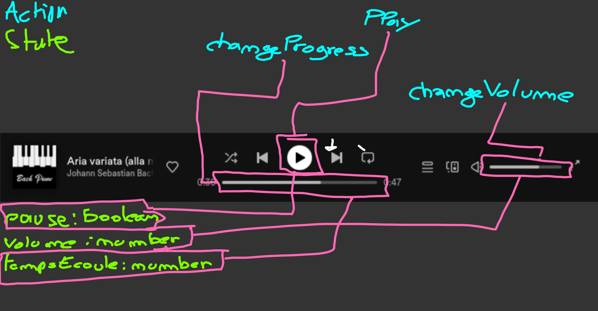

# React : Event et State

Dans une application, l'utilisateur à besoin d'interargir avec les éléments :

- Menu déroulant
- Un player de musique
- Jouer à un jeux video
- Chat
- Carte interactif
- etc ...

C'est la base des applications d'être interactif, sinon il serait impossible des les utiliser.

## Les Event

Les événements se sont des actions que l'utilisateur as menè sur votre application. En react, il n'y pas de grande différence par rapport à **DOM**. Les événements sont passé en **props** de nos balises HTML.

Pour fonctionner, il faut leur attacher une fonction qu'on appel `EventHandler` :

Exemple : Le click sur un bouton

```tsx
export default function SuperButton() {
  function gestionDuClick() {
    console.log('Clique sur le bouton !')
  }

  return (
    <div>
      <button onClick={gestionDuClick}>Clicker moi !</button>
    </div>
  )
}
```

Nous avons la possibilité d'utiliser plusieurs syntaxes :

#### Les fonctions fléchés

```tsx
export default function SuperButton() {
  return (
    <div>
      <button
        onClick={() => {
          console.log('Clique sur le bouton !')
        }}
      >
        Clicker moi !
      </button>
    </div>
  )
}
```

Il éxiste un bon paquet d'événements que l'on peut attacher à nos balise HTML :

La liste se trouve sur la documentation officiel : [Juste Ici](https://beta.reactjs.org/reference/react-dom/components/common#react-event-object)

### Les `EventHandler`

Nos petites fonctions d'événement, tout comme avec le DOM recoivent un seul paramètre, c'est un objet `SyntheticEvent`. Cet objet nous permet de contrôler l'événement de l'utilisateur.

Pour utiliser ce petit objet, il faut tout d'abord le typer :

```tsx
import { SyntheticEvent } from 'react'

export default function SuperButton() {
  // Notre function EventHandler, accépe un paramètre
  // C'est le SyntheticEvent
  function gestionDuClick(event: SyntheticEvent<HTMLButtonElement>) {
    console.log('Clique sur le bouton !')
  }

  return (
    <div>
      <button onClick={gestionDuClick}>Clicker moi !</button>
    </div>
  )
}
```

Cet objet contient les informations relatif à ce qu'il vient de se passer à l'écran !

#### Stoper la propagation

Nous stoppons la propagation sur l'événement du bouton, ce qui veut que le clique ne se répercitera pas sur les balises parentes (div) :

```tsx
import { SyntheticEvent } from 'react'

export default function SuperButton() {
  // Notre function EventHandler, accépe un paramètre
  // C'est le SyntheticEvent
  function gestionDuClick(event: SyntheticEvent<HTMLButtonElement>) {
    event.stopPropagation()

    console.log('Clique sur le bouton !')
  }

  return (
    <div>
      <button onClick={gestionDuClick}>Clicker moi !</button>
    </div>
  )
}
```

#### Annuler le comportement par défaut

Nous pouvons annuler le comportement par défaut de notre navigateur (ex: se rendre sur une lien) avec `event.preventDefault()`.

```tsx
import { SyntheticEvent } from 'react'

export default function SuperButton() {
  // Notre function EventHandler, accépe un paramètre
  // C'est le SyntheticEvent
  function gestionDuClick(event: SyntheticEvent<HTMLLinkElement>) {
    event.preventDefault()

    console.log('Clique sur le bouton !')
  }

  return (
    <div>
      <a href="monsite.com" onClick={gestionDuClick}>
        Clicker moi !
      </a>
    </div>
  )
}
```

#### Les événements de la souris

Il est possible de récupérer les informations de notre souris lorsque nous avons un événement relatif à la souris (ex: MouseEnter, MouseLeaver, Click etc ...)

```tsx
import { MouseEvent } from 'react'

export default function SuperButton() {
  // Notre function EventHandler, accépe un paramètre
  // C'est le SyntheticEvent
  function gestionDuClick(event: MouseEvent<HTMLButtonElement>) {
    // Coordonnées de la souris sur l'écran:
    event.screenX
    event.screenY
    // Coordonnées de la souris par rapport à la page
    event.pageX
    event.pageY
    // Le bouton sur lequel nous avons cliqué
    event.button

    console.log('Clique sur le bouton !')
  }

  return (
    <div>
      <bouton onClick={gestionDuClick}>
        Clicker moi !
      </a>
    </div>
  )
}
```

#### Les événements du clavier

Il est possible de récupérer les informations de notre clavier lors d'un événement concernant le clavier (KeyUp, KeyDown etc ...)

```tsx
import { KeyboardEvent } from 'react'

export default function SuperButton() {
  // Notre function EventHandler, accépe un paramètre
  // C'est le SyntheticEvent
  function gestionDuClavier(event: KeyboardEvent<HTMLInputElement>) {
    // La touche relevé
    event.key

    console.log('Clique sur le bouton !')
  }

  return (
    <div>
      <input type="text" onKeyUp={gestionDuClick} />
    </div>
  )
}
```

#### Les événements de formulaire !

Les événements de formulaire sont au nombre de 2 :

- `onChange` : Lorsqu'une valeur change
- `onSubmit` : Lorsque j'envoie le formulaire

Example : Récupérer le contenue d'un input

```tsx
import { SyntheticEvent } from 'react'

export default function SuperButton() {
  // Notre function EventHandler, accépe un paramètre
  // C'est le SyntheticEvent
  function gestionDuChangement(event: SyntheticEvent<HTMLInputElement>) {
    // La valeur contenu dans l'input
    event.currentTarget.value

    console.log('Changement de l`input')
  }

  return (
    <div>
      <input type="email" onChange={gestionDuChangement} />
    </div>
  )
}
```

Exemple : Valider un formulaire

```tsx
import { SyntheticEvent } from 'react'

export default function SuperButton() {
  // Notre function EventHandler, accépe un paramètre
  // C'est le SyntheticEvent
  function gestionDuFormulaire(event: SyntheticEvent<HTMLFormElement>) {
    // Valider les données du formulaire
    event.currentTarget.data

    console.log('Changement soumission du formulaire')
  }

  return (
    <form onSubmit={gestionDuFormulaire}>
      <input type="email" />
    </form>
  )
}
```

## Le state

### Un petit peu de théorie

**React** est le diminutif de **Reactive Programming**. Le **reactive programming** est un patron de conception (design pattern) au même titre que MVC (**Model View Controller**). Le réactive programming est un conception théorique de comment et pourquoi un interface doit se comporter.

Le réactive programming à été inventé dans les années 2000 par une collaboration de nombreux développeur (Le créateur de React, UbiSOft, Bethesda Software, Microsoft etc ...). Vous retrouverez son **manifeste** (son contenue) sur internet :

https://www.reactiveprinciples.org/

### Comprendre le **reactive programming**

Afin de comprendre l'état (state), il nous faut comprendre sur quoi est basé le reactive programming :


La programmation est complexe, mais peut-être résumé très simplement graçe aux cycles réactif :


### La programation reactive et `React`

**React** à été conçu pour être le plus simple à utiliser. Toutes les notions réactive on était **vulgarisé**. Pour représenter un cycle réacive **react** utilise :

- Les events : Pour les `actions` (onClick, onMouseEnter, onChange etc ..)
- Le `useState` : Pour gérer l'état de l'application

#### Utiliser le `useState`

`useState` est fonction de react permettant de créer un _état_.

> Un état c'est ni plus, ni moins qu'une **variable** ! Cependant cette variable si elle change, notre interface change avec elle. C'est pour cette effet, que l'on doit utiliser `useState`, sans `useState`, notre variable ne serait pas connécté à notre interface.

Un état en react est composé de deux éléments :

- La variable (Contient la valeur de l'état)
- Un setter : Une fonctions permettant de modifier la variable ainsi que notre interface

Exemple : Ouvir ou fermer un menu

```tsx
import { useState } from 'react'

export default function Menu() {
  // Création d'un etat qui est un boolean
  // permettant d'ouvrir ou de fermer un menu
  const [subMenuOpen, setSubMenuOpen] = useState(false)

  // Action permettant d'ouvrir le sous menu
  function openSubMenu() {
    setSubMenuOpen(!subMenuOpen)
  }

  return (
    <nav>
      <ul>
        <li onClick={openSubMenu}>
          Fichiers
          <ul className={subMenuOpen ? 'open' : 'close'}>
            <li>Ouvrir</li>
            <li>Fermer</li>
          </ul>
        </li>
      </ul>
    </nav>
  )
}
```

> La fonction `useState` peut dans certains cas accépter un géneric permettant de typer notre état
>
> ```tsx
> import { useState } from 'react'
>
> type PlayerStatus = 'paused' | 'played' | 'stoped'
>
> export default function Player() {
>   // const status: PlayerStatus = 'paused'
>   const [status, setStatus] = useState<PlayerStatus>('paused')
>
>   // Voici les actions
>   function play() {
>     setStatus('played')
>   }
>
>   // Voici les actions
>   function pause() {
>     setStatus('paused')
>   }
>
>   // Voici les actions
>   function stop() {
>     setStatus('stoped')
>   }
>
>   return (
>       <div className="player">
>         <p>
>           {status === 'paused' ? 'Play' : status === 'stoped' : 'Play' : 'Pause'}
>         </p>
>         <button onClick={play}>Play</button>
>         <button onClick={pause}>Pause</button>
>         <button onClick={stop}>Stop</button>
>       </div>
>    )
> }
>
> ```

### Schématiser une application réactive

Il peut être très difficile de s'y retrouver, **react** est conçu pour être très très très **conçis**. Il dissimule les notions.

On peut très facilement schèmatisé une application réactive, c'est simple et efficace, il faut :

- Un capture d'écran de l'application, un mockup ...
- Des crayons de couleurs

Voici un exemple de schèma réactif :


