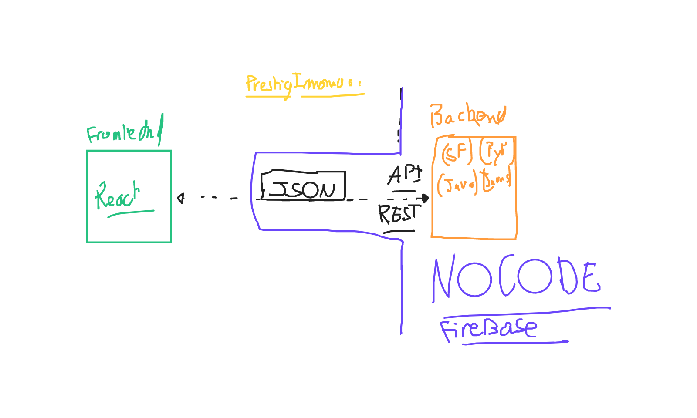
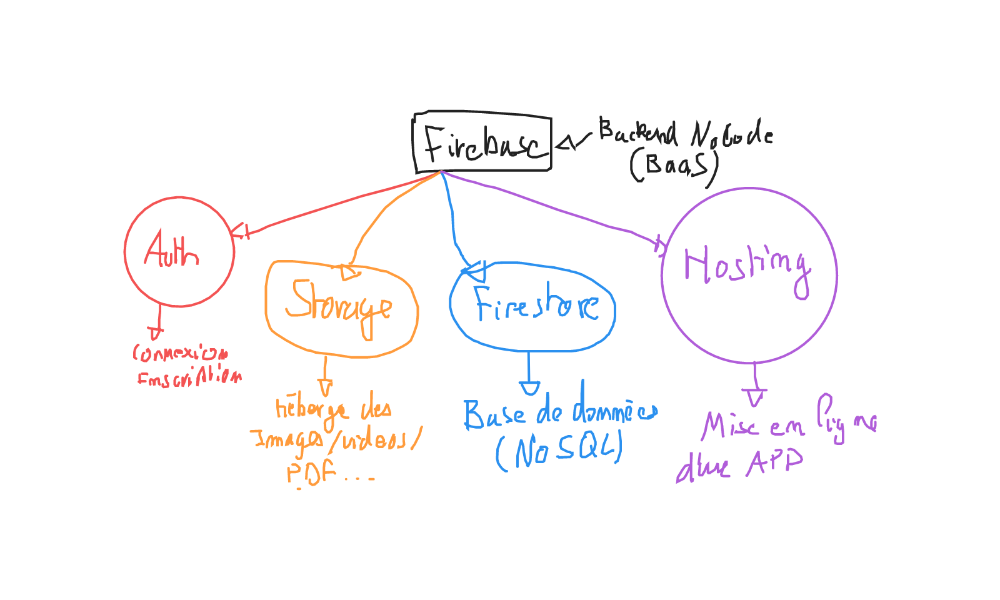

# Firebase

Firebase c'est BAAS (Backend As A Service), soit un backend complet avec authentification, base de données, storage etc ...

Pour accéder à firebase il faut tout d'abord avoir un compte google et ensuite lancer la console firebase sur le lien suivant :

[Get Started](https://firebase.google.com/)

## A propos du backend

Voici un schèma explicatif de la communication entre un frontend et un backend :



## A propos de firebase

Voici un schèma récapitulatif des services de firebase :



## Créer un projet firebase

C'est très simple, une fois connécté sur la console firebase, appuyer sur "Créer un nouveau projet" et laisser vous guidé.o

## Installer et connécter firebase sur une application React

La première étape c'est d'installer le _SDK_ de firebase :

```bash
npm install firebase
```

Rendez-vous dans votre dashboard de projet et cliqué sur les "paramètres du projet" et ensuite, puis en bas de la page, cliqué sur le type d'application que vous souhaitez connécté.

Un fois nommé, firebase vous affiche un fichier de configuration à placer dans votre application. Ce fichier n'est ni un composant, ni du style, etc ... C'est une librairie. Il faut donc créer un nouveau dossier dans `src` : `Lib`.

Le dossier `Lib` contient le code de toutes les librairies externes à React. Créé l'intérieur de ce dossier un fichier `Firebase.tsx` par éxemple et placer la configuration firebase.

Exemple de fichier `src/Lib/Firebase.tsx` :

```tsx
import { initializeApp } from 'firebase/app'
// TODO: Vous pouvez ici importer le service firebase de votre choix
// https://firebase.google.com/docs/web/setup#available-libraries

// La configuration de firebase.
// (il est conseillé de placer cette configuration dans un fichier .env,
// React sait très bien le lire:
// https://vitejs.dev/guide/env-and-mode.html)
const firebaseConfig = {
  apiKey: import.meta.env.VITE_FIREBASE_APIKEY,
  authDomain: import.meta.env.VITE_FIREBASE_AUTHDOMAIN,
  projectId: import.meta.env.VITE_FIREBASE_PROJECTID,
  storageBucket: import.meta.env.VITE_FIREBASE_STORAGEBUCKET,
  messagingSenderId: import.meta.env.VITE_FIREBASE_MESSAGINGSENDERID,
  appId: import.meta.env.VITE_FIREBASE_APPID,
}

// Application Firebase
export const firebase = initializeApp(firebaseConfig)

// Nous pouvons aussi en faire un export par défaut
export default {}
```

Il est désormais possible de suivre la documentation de firebase et d'initialiser les services que nous allons utiliser :

```tsx
import { initializeApp } from 'firebase/app'
import { getAuth } from 'firebase/auth'
import { getFirestore } from 'firebase/firestore'

// TODO: Vous pouvez ici importer le service firebase de votre choix
// https://firebase.google.com/docs/web/setup#available-libraries

// La configuration de firebase.
// (il est conseillé de placer cette configuration dans un fichier .env,
// React sait très bien le lire:
// https://vitejs.dev/guide/env-and-mode.html)
const firebaseConfig = {
  apiKey: import.meta.env.VITE_FIREBASE_APIKEY,
  authDomain: import.meta.env.VITE_FIREBASE_AUTHDOMAIN,
  projectId: import.meta.env.VITE_FIREBASE_PROJECTID,
  storageBucket: import.meta.env.VITE_FIREBASE_STORAGEBUCKET,
  messagingSenderId: import.meta.env.VITE_FIREBASE_MESSAGINGSENDERID,
  appId: import.meta.env.VITE_FIREBASE_APPID,
}

// Application Firebase
export const firebase = initializeApp(firebaseConfig)
// Initialize le service d'authentification
export const firebaseAuth = getAuth(firebase)
// Initialise le service firestore (la base de données)
export const firebaseDb = getFirestore(firebase)

// Nous pouvons aussi en faire un export par défaut
export default { auth: firebaseAuth, db: firebaseDb }
```

## Créer un nouvelle utilisateur avec firebase en utilisant l'email et le mot de passe

Pour chaque opération que vous allez réaliser avec firebase (inscrire un nouvelle utilisateur, créer un nouveau bien immobilier etc ...) ajouter une fonction dans le fichier `src/Lib/Firebase.tsx` ou vous pouvez aussi créer un nouveau fichier comme `src/Lib/Auth.tsx` et y placer les fonctions permettant de se connécter, s'inscrire etc ...

Maintenant, nous pouvons facilement créer une fonction qui inscrie un nouvelle utilisateur avec son email et son mot de passe :

Exemple dans `src/Lib/Auth.tsx` :

```tsx
import {
  createUserWithEmailAndPassword,
  signInWithEmailAndPassword,
} from '@firebase/auth'
import { firebaseAuth } from './Firebase'

/**
 * Inscrie un nouvelle utilisateur sur l'application
 */
export async function createAccount(email: string, password: string) {
  // On obtient le userCredential de firebase contenant les informations
  // de l'insertion du nouvel utilisateur
  const credential = await createUserWithEmailAndPassword(
    firebaseAuth,
    email,
    password,
  )

  // Maintenant je retourne l'utilisateur firebase
  return credential.user
}

/**
 * Connécte un utilisateur sur l'application
 */
export async function loggin(email: string, password: string) {
  // On obtient le userCredential de firebase contenant les informations
  // de l'utitlisateur
  const credential = await signInWithEmailAndPassword(
    firebaseAuth,
    email,
    password,
  )

  // Maintenant je retourne l'utilisateur
  return credential.user
}
```

## Utiliser la base de données firestore

Pour chaque opération que vous allez réaliser avec firebase (inscrire un nouvelle utilisateur, créer un nouveau bien immobilier etc ...) ajouter une fonction dans le fichier `src/Lib/Firebase.tsx` ou vous pouvez aussi créer un nouveau fichier comme `src/Lib/Database.tsx` et y placer les fonctions permettant d'interroger la base de données etc ...

Firebase utilise une base de données NoSQL. C'est à dire qu'elle ne posséde pas de tables et de colonnes (des collections et des documents) mais aussi qu'il n'y pas de schèma (on peut insérer ce que l'on veut ou l'on veut !).

Du coup, son avantage principal c'est :

- Adaptation
- Rapide (2 à 50 fois plus rapide)

Le désavantage :

- Pas de structure
- Pas de validation / Pas de vérification

### Typescript ... à l'aide !

Typescript est un langage typé, donc il peut imposer une structure et de la validation !

Nous pouvons très bien ajouter un fichier `src/Type/Database.tsx` et définir la structure de notre base de données !

Exemple `src/Type/Database.tsx` :

```tsx
/**
 * Ceci est un type générique, c'est typescript avancée, c'est une
 * technique très puissante :
 *
 * https://www.typescriptlang.org/docs/handbook/2/generics.html
 */
export type Identifiable<T extends {}> = T & { id: string }

/**
 * Défini un address
 */
export type Address = {
  country: string
  city: string
  street: string
  postCode: string
}
```

Et `src/Lib/Database.tsx` :

```tsx
import {
  addDoc,
  collection,
  doc,
  getDoc,
  getDocs,
  limit,
  query,
} from '@firebase/firestore'
import { Address, Identifiable } from '../Type/Database'
import { firebaseDb } from './Firebase'

/**
 * Je créé un constante contenant le nom de la collection
 * Fireabse pour les address. Ce qui m'évite de la réécrire
 * à chaque et de faire de fautes de frappe
 */
export const ADDRESS_COLLECTION = 'addresses'

/**
 * Insére une nouvelle adresse dans firebase
 */
export async function createAddress(address: Address) {
  // Je récupére d'abord la collection d'address
  const col = collection(firebaseDb, ADDRESS_COLLECTION)
  // On insére des données dans la collection. Nous récupérons
  // une référence firebase qui contiendra l'id de l'address
  // qui vient d'être inséré
  const reference = await addDoc(col, address)

  // La reference contient l'identifiant créé par firebase
  const id = reference.id

  // Je récupére le snapshot du document insérer dans la base de données
  const snap = await getDoc(doc(firebaseDb, ADDRESS_COLLECTION, id))

  // Nous pouvons récupérer l'address (sans son id)
  const newAddress = snap.data()

  // On retourne l'addres avec son id.
  // On utiliser "as" afin de s'assurer du type de retour
  return {
    id: id,
    ...newAddress,
  } as Identifiable<Address>
}

/**
 * Récupére les 10 dernières adresse
 */
export default async function findLast10Address() {
  // On récupére la collection de la base de données :
  const col = collection(firebaseDb, ADDRESS_COLLECTION)
  // On prépare une query :
  const q = query(col, limit(10))

  // On récupére les "snapshots"
  const snaps = await getDocs(q)

  // Pour retourner les address avec les ids, ils nous faut
  // boucler sur les documents des snaps et fusionner l'id et
  // et les données
  return snaps.docs.map(doc => ({
    id: doc.id,
    ...doc.data(),
  })) as Identifiable<Address>[]
}
```
