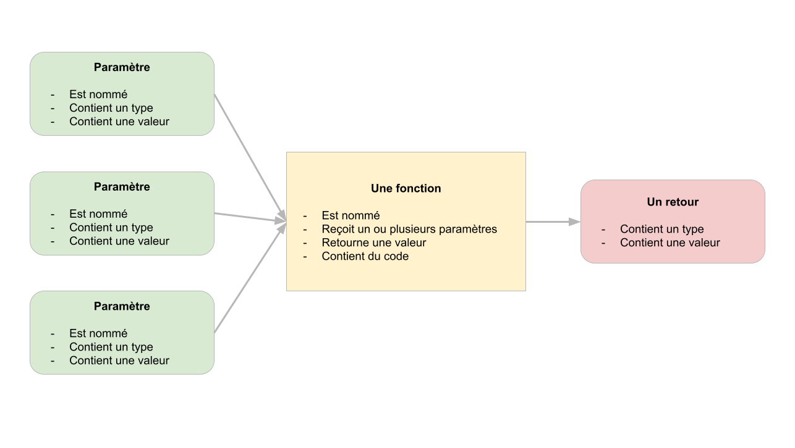
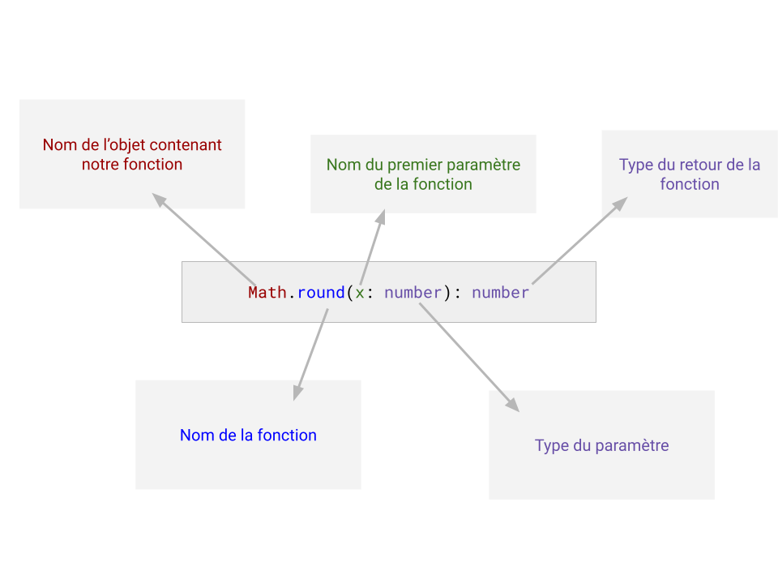

# Les fonctions

C'est probablement le chapitre le plus important de typescript. En effet, afin de ne pas répéter des lignes de codes, de réaliser des opérations complexe, typescript utilise des fonctions. Ce sont comme des boîtes contenant des instructions que nous pouvons appeler quand nous en avons envie. Ces boites nous sont très utile ! Elles permettent d'organiser notre code sans jamais avoir à ce répéter.

Les fonctions sont tout de même plus compliqué que de simple boîte. Elle peuvent recevoir des **paramètres** et **retourner une valeur** (grâce à mot clé **return**) :



> L'image plus haut récapitule le fonctionnement des fonctions.

##  La Signature

Une fonction possède naturellement une *notice d'utilisation* que l'on appel : **la signature** :

```typescript
// Éxemple de signature de la fonction `console.log`
console.log(...args: any[]): void

// Éxemple de signature de la fonction `parseInt`
parseInt(a: any): number

// Éxemple de signature avec la fonction `Array.map`
Array.map<A, B>(handler: (a: A) => B): B[]
```

Ces dernières fournissent le mode **d'emploi** de l'utilisation d'un fonction. Afin de comprendre ses signatures il nous faut tout d'abord comprendre son fonctionnement

> **Pro Tip** : Vous pouvez obtenir la signature d'une fonction avec VSCode en maintenant la touche `<CTRL>` de votre clavier et en survolant la fonction avec la souris

## Utiliser des fonctions

Pour utiliser des fonctions, rien de plus simple. Il suffit d'écrire le nom de la fonction et entre parenthèse, spécifier les paramètres. Dés lors la fonction se lance et nous retourne une valeur (ou pas, tout dépend de la fonction appelé !) :

```typescript
// Utilisons la fonction console.log qui affiche
// un paramètre dans la console
console.log('Coucou les amis') // retourne « void » (soit rien du tout)

// L'objet console permet aussi d'afficher des tableaux
// et des objets !
console.table([12, 5, 9, 13, 14, 19]) // retourne « void »

// Il éxiste aussi des fonctions mathématique :
Math.round(12.251315) // retourne 12
```

Il existe de très nombreuse fonction en javascript (et donc en typescript aussi). Maintenant que nous connaissons leurs utilisation, il devient plus simple de comprendre une signature :



## Créer des fonctions

Nous savons maintenant utiliser des fonctions, mais nous pouvons créer nos propres fonctions ! Attention, javascript est un langage « moderne » et « fonctionnelle » (basé sur l'utilisation de fonctions). Cela veut dire qu'il éxiste différente formes de fonctions que nous allons découvrir :

### Les fonctions « compilé »

Ces fonctions sont sûrement les plus simples, elles sont déclarer lors de la compilation du javascript. Prenons un exemple avec une fonction « additionner » :

```typescript
// Création d'une fonction additionner
function additionner(x: number, y: number): number {
  return x + y
}

// Nous pouvons dès lors appeler notre fonction :
const resultat = additionner(10, 5) // contient 15
```

> Typescript est un « superset » de javascript, ce qui signifie que le typage de nos paramètres et valeurs de retour sont facultatif. Cependant, pour des raisons de clarté, il est recommandé de toujours typé les paramètres. Pour le retour, cela n'est pas toujours nécessaire

### Les fonctions « fléchés »

Il existe un autre type de fonctions, plus répandu et bien plus rapide à écrire : **Les fonctions fléchés**. Ces dernières ne sont pas déclarer lors de la compilation mais lors de l’exécution de notre code. Elles n'utilise plus le mot cle `fonction` mais s’enregistre directement dans une variable (ou constante) ! 

```typescript
// Création d'une fonction fléché : « additionner »
const additionner = (x: number, y: number): number => {
  return x + y
}

// Création d'une fonction fléché à 1 seule instruction :
const additionner = (x: number, y: number): number => x + y

// À noter que le type de retour n'est pas obligatoire
const additionner = (x: number, y: number) => x + y
```

> Même si ces fonctions peuvent vous paraître plus compliqué, elles sont très répandu et utilisé. En effet, nous verrons que javascript et typescript sont des langages dit « fonctionnelle », il exploite énormément l'utilisation de fonctions. Il est donc fondamentale de bien comprendre ces dernières.

### Bonus : Les « applications partielle » ou fonction « curried »

Grâce à l'utilisation de fonctions fléché il est possible de créer des fonctions dite : **à application partielle** ou **fonction curried**. Ces dernières, bien que complexe, sont extrêmement puissante. Elle permette la création de nouvelle fonction à partir d'autre fonctions !

```typescript
// Voici un éxemple de fonction « curried »
const additionner = (x: number) => (y: number) => x + y

// Pour appeler la fonction :
const resultat = additionner(10)(5) // 15

// Nous pouvons aussi créer d'autre fonction à partir
// de cette fonction !
const additionner10 = additioner(10)
const additionner5 = additionner(5)

// Maintenant nous pouvons utiliser nos nouvelles
// fonctions :
const resultat2 = additionner10(2) // 12
const resultat3 = additionner5(10) // 15
const resultat4 = additionner10(additionner5(2)) // 17
```

> Ces fonctions nous serons très utile lors de la création « d'événement ». Nous découvrirons react et l'utilisation de fonctions « curried » prendra tout son sens !

## Les fonctions « pure » et les fonctions « impure »

En programmation fonctionnelle il existe 2 « familles » de fonction.

- **Les fonctions pure** : Se sont des fonctions « prédictible », leurs comportement ne change pas et peuvent être entièrement prévisible. C'est le cas de notre fonctions « additionner », le code de cette fonction retourneras toujours un résultat et ne dépend d'aucune « aide extérieur ».
- **Les fonctions impure** : Se sont des fonctions qui dépendent d’éléments que nous ne maîtrisons pas. En effet, la fonction `console.log` dépend de l’existence d'une console mais, que ce passerait-il si la console n’existe pas ? La fonction échouerais. Ces fonctions sont dite « impure » car nous ne pouvons maîtriser l'intégralité de son code. 

Essayer de regarder les fonctions suivantes et de deviner si elles sont « pure » ou « impure » :

```typescript
Math.round(13.45)
console.log('test')
parseInt('34')
fetch('http://mon-api.com/livres')
document.querySelector('h1')
Math.floor(34.89)
```

Solution :

```typescript
Math.round(13.45) // pure
console.log('test') // impure, si la console n'éxiste pas, la fonction ne marche pas
parseInt('34') // impure, la fonction peut échouer si on envoie "test" par exemple
fetch('http://mon-api.com/livres') // impure, que ce passe t'il si le site mon-api.com n'éxiste pas ?
document.querySelector('h1') // impure, la page html peut ne pas avoir de h1
Math.floor(34.89) // pure
```

Comme vous le devinez, les fonctions impure sont légions en typescript. Il est très important de comprendre ce concept car, un programme typescript (ou javascript) est souvent un programme d'interface. Nous développons des applications visuel ou les personnes peuvent cliquer, scroller, naviguer etc … Que ce passe t'il si la moindre erreur se produit durant un clique ? Et bien notre programme entier devient **inutilisable** ! C'est ici quelque chose que vous ne souhaitez pas. Imaginé utiliser sur votre service de streaming favoris, en cliquant sur une vidéo l'application reste figé et rien se se charge. Cela risque de vous contrarié. Il faut donc toujours « isoler » les fonctions « pure » et « impure ».

> Nous découvrirons des techniques permettant l'isolement de ces fonctions dite « impure » lorsque nous commencerons « React ». Pour le moment, garder en tête de toujours vous poser cette question : "Cette fonction est-elle pure ?"

## Les tableaux et les fonctions

Dans cette partie nous allons mixer nos connaissances des fonctions avec la puissance des tableaux ! En effet, en javascript, lorsque nous devons traiter des données sous forme de tableaux nous n'utilisons **presque jamais les boucle for**, il existe un façon bien plus puissante et optimiser afin de boucler.

### L'opération `forEach`

Cette opération permet d’exécuter du code pour chaque élément d'un tableaux. Cela ressemble beaucoup à une boucle « for » classique. Cette fonction accepte un fonction en paramètre que l'on nomme « **callback** ». Cette **callback** est exécutée pour chaque éléments du tableau et reçoit 2 paramètre : `x: A` et `index: number`. Voici si signature :

```typescript
Array.forEach<A>((a: A, index: number) => any): A[]
```

>  `A` ici est un « generic » nous verrons cela un peut plus tard, retenez juste que cela dépend de ce que contient votre tableaux, si c'est un tableau de `string[]` alors A sera `string`

```typescript
// Création d'un tableaux de notes 
const notes: number = [12, 9, 13, 20, 8]

// On boucle et affiche les notes en utilisant 
// l'opération forEach :
notes.forEach(
  (note: number, index: number) => console.log(`Note n°${index} : ${note}`)
)

// Nous pouvons aussi découper notre code pour améliorer la lisibilité :
function afficherNote(note: number, numero: number) {
  console.log(`Note n°${numero} : ${note}`)
}

// nous pouvons réutiliser notre fonction plus haut :
notes.forEach(afficherNote)
```

> **Attention :** Cette opération n’altère en rien notre tableaux original ! Les `notes` resterons exactement les même quelle que soit le code que contient le `forEach`

### L'opération `map`

Cette opération est très similaire à `forEach` mais cette fois, nous allons pouvoir créer un **nouveau tableaux** à partir d'un autre tableaux. Voici la signature de `map` :

```typescript
Array.map<A, B>((a: A, index: number) => B): B[]
```

> Noté ici le type de retour de `map`, il est bien différent de celui de `forEach`. Même si cette signature peut vous paraître compliqué, nous éluciderons le mystère des « génerics » très bientôt !

Et voici un exemple d'utilisation de map : imaginons que nous souhaitons ajouter 2 points à toutes une série de notes :

```typescript
// création d'un tableau de note
const notes: number[] = [12, 8, 7, 18, 20, 14]

// On utilise `map` afin de créer un nouveau
// tableaux avec chaque note augmenté de 2
const nouvelleNotes = notes.map((note: number) => note + 2)

// A noter que le typage n'est pas obligatoire, typescript
// est assez intéligent pour deviner les types tout seul :
const nouvelleNotes2 = notes.map(note => note + 2)

// On peut aussi utiliser une fonction curried !
const add = (x: number) => (y: number) => x + y

const nouvelleNotes3 = notes.map(add(2))
```

> **ATTENTION** : `map` ne modifie pas le tableaux en cours mais renvoie un tout nouveau tableaux ! On dit que cette fonction est `pure` car elle ne modifie en rien quelque chose d’existant.

### L'opération `filter`

### L'opération `reduce`

## Entraînez-vous !

- [Maîtriser les fonctions avec une calculatrice](https://codepen.io/djeg/pen/bGKJbox)

[Chapitre précédent : Les fondations](./fondation.md)

[Chapire suivant : Les types](./types.md)