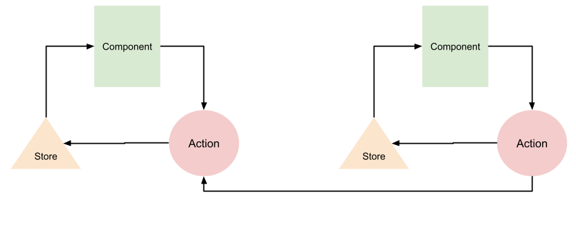
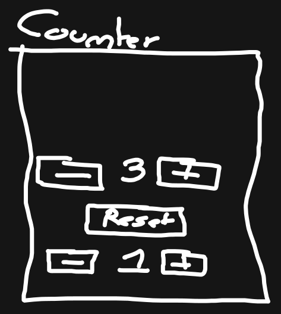

# React et Nanostores

[Nanostores](https://github.com/nanostores/nanostores#guide) est un tout petit outil permettant de gérer l'état d'une application.

Il est utilisable sur tout les frameworks et librairies javascript. Dès que nous avons une interface à développer avec javascript, nanostores peut être installé et utilisé, peut importe la technologie !

## Installation

Pour installer nanostores :

```bash
$ npm i nanostores @nanostores/react
```

## Concepts et fonctionnement

Nanostores reprend les concepts de la programmation reactive, mais les simplifie en supprimant la notion d'effet :



### Exemple avec le conteur :

Prenons l'interface suivante :



### Le store

Le store est une boite contenant un partie de l'état de notre application. Elle peut par exemple contenir l'état de notre compteur :

Pour créer un store, il faut utiliser la fonction `map` de nanostore :

```tsx
import { map } from 'nanostores'

export const CounterStore = map({
  counter: 0,
  increment: 1,
})
```

> Au lieu d'utiliser `useState` nous utilisons `map` de nanostore. On lui donne en paramètre un objet contenant notre état !

### Utiliser le store dans un composant

Maintenant, essayons récupérer l'état contenue dans le store du counter dans notre composant :

```tsx
export default function Counter() {
  // On utilise useStore afin de récupérer le contenu de l'état
  const { counter, increment } = useStore(CounterStore)

  return (
    <>
      <button>+</button>
      <p>{counter}</p>
      <button>-</button>
      <button>+</button>
      <p>{increment}</p>
      <button>-</button>
    </>
  )
}
```

> L'avantage est conséquent : Notre store peut-être utilisé partout !

### Utiliser les actions

Pour modifier un `store`, il faut créer une action.

L'action se créer avec le fonction `action` de nanostores. Elle prend 3 paramètres :

1. Le store pour lequel l'action s'éxécutre
2. Un petit nom (ce nom est uniquement utilisé lors du debuggage).
3. Une fonctions permettant de modifier notre store

#### Exemple avec notre compteur

```tsx
import { map, action } from 'nanostores'

export const CounterStore = map({
  counter: 0,
  increment: 1,
})

// Action permettant d'incrementer le
// compteur
export const increment = action(CounterStore, 'increment', store => {
  // On récupére le contenu du store
  const { counter, increment } = store.get()

  // On calcule le nouveau conteur
  const newCounter = counter + increment

  // On enregistre le nouveau compteur dans le store
  store.setKey('counter', newCounter)
})

// Action permettant de décrémenter
export const decrement = action(CounterStore, 'decrement', store => {
  // On récupére le contenue du store
  const { counter, increment } = store.get()

  // On calcule le nouveau conteur
  const newCounter = Math.max(0, counter - increment)

  // On enregistre le nouveau conteur
  store.setKey('counter', newCounter)
})

// on change l'incrément
export const changeIncrement = action(
  CounterStore,
  'changeIncrement',
  // En plus de recevoir le store,
  // j'indique que je recois un nombre
  // qui correspond à la valeur
  // du nouvel l'incrément
  (store, newIncrement: number) => {
    if (newIncrement < 1) {
      store.setKey('increment', 1)
    }

    store.setKey('increment', newIncrement)
  },
)
```

### Utiliser les actions

Pour utiliser une action, il suffit de l'importer et l'appeler :

```tsx
import { increment, decrement, changeIncrement } from './CounterStore'

increment()
decrement()
changeIncrement(5)
```

#### Exemple dans un composant !

```tsx
import {
  CounterStore,
  increment,
  decrement,
  changeIncrement,
} from './CounterStore'

export default function Counter() {
  // On utilise useStore afin de récupérer le contenu de l'état
  const { counter, increment } = useStore(CounterStore)

  return (
    <>
      <button onClick={decrement}>-</button>
      <p>{counter}</p>
      <button onClick={increment}>+</button>
      <button onClick={() => changeIncrement(increment - 1)}>-</button>
      <p>{increment}</p>
      <button onClick={() => changeIncrement(increment + 1)}>+</button>
    </>
  )
}
```

### Pensez « Nanostore »

À chaque écran de l'application, nous devons associer un composant, à chaque composant nous associerons un store ! Nous pouvons aussi associe un style.

Prenons le design suivant :

https://www.figma.com/file/bwQ0R9kNPCcCVPqpaySbpE/Todo-App?node-id=0%3A1&t=cbRxYmUjqOpfpAD7-1

- Chaques écrans est associé à un composant
- Chaque composant peut avoir un store
- Chaque composant peut avoir un style

Ce qui nous donnes un architecture de ce style :

```
src/
  main.tsx
  components/ # Contient les composants
    App.tsx
    Menu.tsx
    Profil.tsx
    Home.tsx
    NewList.tsx
    TodoList.tsx
    Connexion.tsx
    Subscription.tsx
  styles/
    App.style.tsx
    Menu.style.tsx
    Profil.style.tsx
    Home.style.tsx
    NewList.style.tsx
    TodoList.style.tsx
    Connexion.style.tsx
    Subscription.style.tsx
  stores/
    App.store.tsx
    Menu.store.tsx
    Home.store.tsx
    NewList.store.tsx
    TodoList.store.tsx
    Profil.store.tsx
    Connexion.store.tsx
    Subscription.store.tsx
  lib/ # Fonctions d'aide
    time.tsx
    math.tsx
    dates.tsx
```
