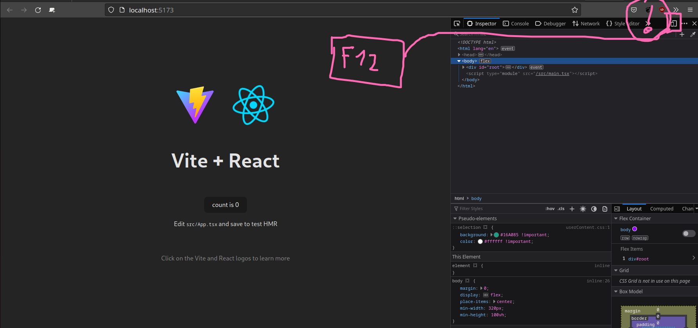
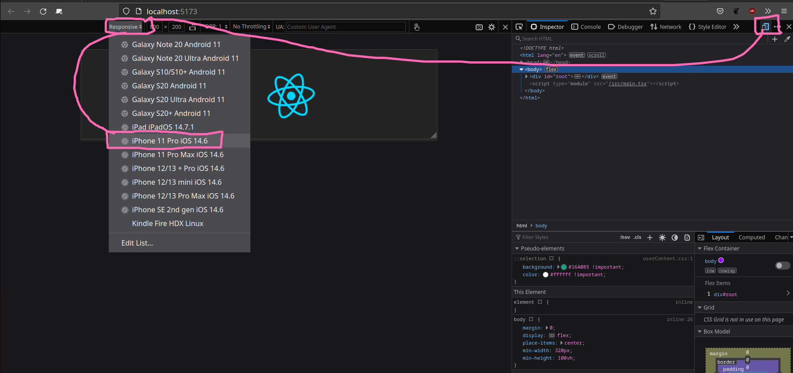

# React : Présentation

React est une librairie javascript (ou typescript), permettant de créer des **applications**. Le principe d'application est de proposer quelque chose d'installable, fluide, performant, adaptable et surtout plus intelligente qu'un simple site internet. Voici des exemples d'applications :

- [LinkedIN](https://www.linkedin.com/)
- netflix
- discord
- facebook / instagram
- leboncoin
- blablacar
- sncf
- spotify
- etc ...

C'est un outil incontournable dans le millieu professionnel ! Partout dans le monde au passage.

C'est outil développé par META (anciennement facebook), ce n'est cependant pas le seul sur le marché :

- Flutter (google)
- Angular (google) - Se faire remplacer par flutter
- Vue (vue)
- Svelte

L'avantage de **react** par rapport à la concurrence, c'est qu'il s'apprend très vite ! Il n'y a pas besoin de beaucoup de prérequis et surtout il est basé sur un concept familier : `Le composant` (qui s'apparente à une balise HTML).

React viens avec 2 versions une version pour le _web_ : **reactjs** et une version pour les téléphones et télévision : **react-native**.

Vous trouverez le lien de la documentation ainsi que des tutorielles très interessant ici :

- [La documentation officiel](https://beta.reactjs.org/learn#)
- [Sur grafikart](https://grafikart.fr/tutoriels/react)
- [Sur openclassrooms](https://openclassrooms.com/en/courses/7132446-create-a-web-application-with-react-js)

## Installation

Pour pouvoir utiliser et apprendre React il faut être à l'aise avec :

1. HTML et CSS
2. Javascript
3. Typescript (bonus)

Dans cette formation nous utiliserons **typescript** car moins de bug et aussi **bien plus d'emploie à la clef**.

Il faut aussi avoir d'installer sur sa machine :

- [NodeJS et NPM](https://nodejs.org/en/)

### Utiliser un `bootstraper`

Un `bootstraper` est un outil de démarage nous permettant de mettre en place tout les fichiers et dossier pur commencer à travailler en react.

Il en éxiste plusieurs sur la marché :

- [CRA](https://create-react-app.dev/docs/getting-started/) : C'est l'outil officiel installant tout un tas de dépendance (webpack etc ..) permettant de demarrer facilement un projet react
- [vite](https://vitejs.dev/guide/) : c'est l'outil le plus performan du marché permettant de démarrer une application react.

### Démarrer un projet avec `vite` !

Comme beaucoup d'outil en informatique pour créer une application react il faut utiliser **la ligne de commande** !

Placez-vous dans le dossier ou vous voulez créer votre application react (cette application sera un simple dossier). Ensuite, lancer la commande suivante :

```bash
$ npm create vite@latest mon-application-react --template
```

> Sur le nom de l'application, pas d'espace ni de caractère de spéciaux

Cette commande créé un dossier `mon-application-react` avec le code de demarrage.

Il vous sera posé 2 questions :

1. Le choix de la librairie, choissisez « React »
2. Le choix de la technologie, choisissez « Typescript »

Une fois les questions répondu, rendez vous dans le dossier de l'application et lancer l'installation :

```bash
$ cd mon-application-react
$ npm i
```

Pour démarrer l'application il faut lancer le serveur de développement pour cela :

```bash
$ npm run dev
```

## Se préparer à coder !

Lorsque l'on développe une **application web**, il est impératif de créer en tout premier lieu un version **mobile** ! 85% du traffic sur votre application sera sur des mobiles.

> Attention, dans certains cas l'application peut être utilisé uniquement sur un ordinateur de bureau. Si tel est la cas, oublié la version mobile.

Cette technique s'appel le **mobile first**.

### Comment faire :




### Installer les developper tool

C'est outil permettant de mieux débugger et utilisé un application React.

- [Firefox](https://addons.mozilla.org/en-US/firefox/addon/react-devtools/)
- [Chrome](https://chrome.google.com/webstore/detail/react-developer-tools/fmkadmapgofadopljbjfkapdkoienihi)
- [Edge](https://microsoftedge.microsoft.com/addons/detail/react-developer-tools/gpphkfbcpidddadnkolkpfckpihlkkil)

> **Entrainez-vous**
>
> Créer une application react en utilisant vite nommé "mon-app-test". Installer les dépendances et démarrer le serveur, puis dans votre navigateur activer l'inpécteur et la vue mobile :)
>
> N'hésitez pas à installer l'extension react developper tools
