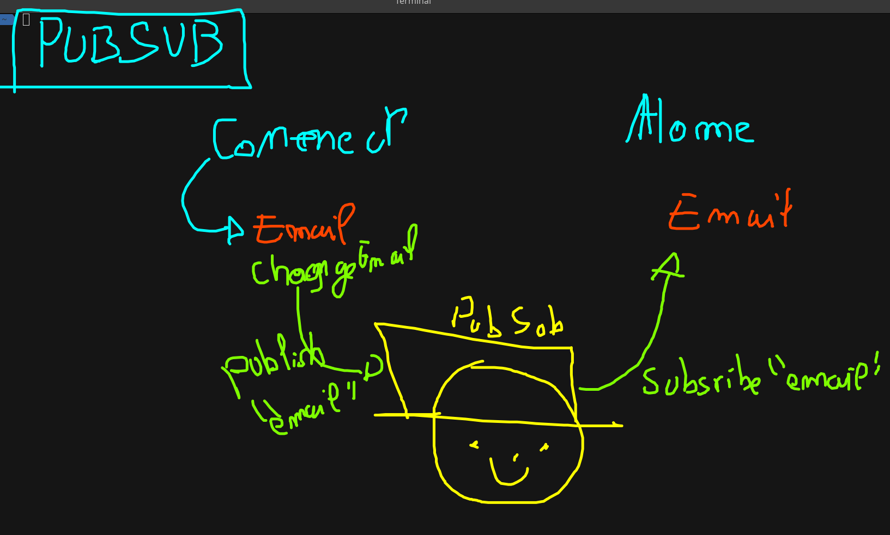

# React et la gestion d'état

React est un outil très puissant cependant il souffre d'un petit problème ...

**les états appartiennent à des composants et ne peuvent pas en sortir facilement**

## Quelle est le problème ?

Immaginons, que dans un composant **A** éxiste un état **`time: number`**

Maintenant je souhaiterais utilise l'état **`time: number`** dans un composant `B`.

Comment est-ce faisable ?

### Solution 1 : Utiliser les `props`

L'idée est de placer l'état dans le composant **papa** et d'utiliser les props afin de passer l'état et sa fonction de modificiation :

> Un exemple disponible [dans le dossier `demo-state-management`](../../src/demo-state-management/)

> Cette solution fonctionne pour les petits projets mais souffre de beaucoup de défaut pour les projet de taille moyenne ou grand

### Solution 2 : Utiliser les `context`

En react, il éxiste un composant un peu particulier dont le rôle est de stocké des valeurs on fonctions et les rendre accesible partout !

Ce sont les context. Cela correspond à une boite contenant une/des valeur(s) accessible partout dans l'application !

Pour créer un context :

1. utiliser la fonction `createContext` (spécifier le type ainsi que la valeur par défaut de la boite)
2. Mettez un place le composant provider permettant de remplir la boîte
3. Utiliser `useContext` ou vous le souhaitez pour accéder aux valeur stocké !

> Un exemple complet est [disponible juste ici](../../src/demo-state-management2/)

> Bien qu'utilisé dans pas mal de projet, cette solution n'est pas la plus optimal... Bien plus de fichiers, le code est compliqué !

### Solution 3 : Utiliser `pubsub`

`pubsub` est une petite librairie permettant de publier et souscrire à des messages. L'idée est simple, des composant peuvent « souscrire » à un « sujet » (topic). Dès qu'un message est publier dans le sujet (topic), ils sont prévenue et peuvent récupérer le message !

L'idée est la suivante, certains composant publie des message dans un topic, et d'autre composant vont récupérer le dernier message du topic :



#### Installation

Pour installer pubsub sur un projet c'est très simple :

```bash
$ npm i pubsub-js
$ npm i -D @types/pubsub-js
```

#### Utilisation

Pour utiliser PubSub, c'est très simple :

1. Importer `PubSub` :

```tsx
import PubSub from 'pubsub-js'
```

2. Publiser un message dans un `topic`

```tsx
PubSub.publish('nom du topic', 'Message !')
// Exemple, publier un email
PubSub.publish('email', 'john@mail.com')
// Différement d'un tchat, nous pouvons tout publier
// Exemple : une liste de course
PubSub.publish('listeDeCourse', ['Chocolat', 'Pain'])
```

3. Souscrire et désouscrire à un topic :

```tsx
// C'est une clefs de souscription
const token = PubSub.subscribe('monTopic', (message: string) => {
  // On peut ce que l'on veut du dernier message !
  // ICI LA FONCTION EST APPELLÉ À CHAQUE NOUVEAU MESSAGE
})
```

Plus tard dans le code, je peux désouscrire :

```tsx
PubSub.unsubscribe(token)
```

### 4. Solution : Centralisation de l'état

En react, la gestion de l'état peut très vite devenir très très compliqué !

Heureusement des personnes ont réglé problème pour nous. L'idée est d'installer une librairie de gestion de l'état. L'état ne se trouve plus dans les composants, les actions non plus, les effets non plus tout est centralisé à l'extérieur et réutilisable partout !

Parmis les librairies de gestion d'états voici les plus populaire :

1. [Redux](https://react-redux.js.org/) : C'est la plus répandu, la plus populaire cependant elle est « assez longue à apprendre ».
2. [Recoil](https://recoiljs.org/), [zustand](https://github.com/pmndrs/zustand) et [MobX](https://mobx.js.org/README.html) : Ce sont les alternatives principal à Redux, ils sont assez répandu par contre certains ne supporte pas très bien Typescript.
3. [nanostores](https://github.com/nanostores/nanostores) : Bien plus simple, très rapide et surtout moins difficile à apprendre.
