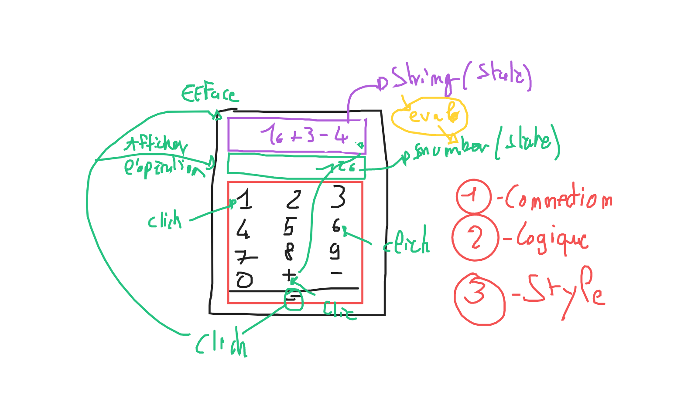

# La calculatrice

Le principe est de réaliser une petite calculatrice interactive avec React.

## Mockup

## Quelques informations

Il y a 2 état, un pour l'écran d'affichage et un autre pour l'écran de résultat. Il y a aussi tout un tas d'événement...
