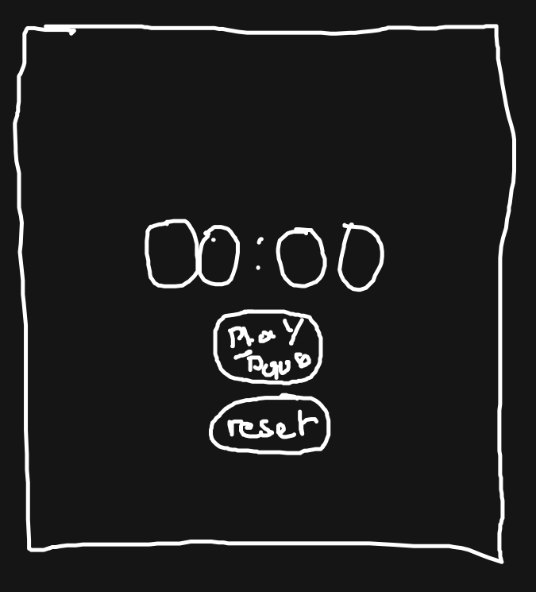

# Le Chronomètre

Dans cette exercice nous allons développer un chronomètre interactif :

## Wireframe :



## Préparer le code

Dans cette exercice, allez au plus simple et mettre en place la structure suivante :

```
src/
  main.tsx
  exos-chrono/
    components/
      App.tsx
    styles/
      App.style.tsx
```

> Dans le fichier `src/exos-chrono/components/App.tsx`, placer le code du composant

> Dans le fichier `src/exos-chrono/styles/App.style.tsx` placer le style de votre chronomètre

## Structure d'un composant

Le composant react est un fonction séparer en 4 couches :

1. L'état (`useState`)
2. Les actions
3. Les effets (`useEffect`)

### Exemple :

```tsx
export default function App() {
  // STATE : useState

  // ACTIONS

  // EFFET : useEffect

  // JSX
  return <p>interface</p>
}
```

### Utiliser setTimeout

`setTimeout` est une fonction de javascript permettant de créer un « timer ».

Elle se déclenche et s'arréte, l'objetif est de lancer une fonction tout XXX milliseconds :

```tsx
let timer = window.setInterval(() => {
  // Fonction se déclanchant toutes les 1000 ms
}, 1000)

// Un peu plus tard dans le code ...

// Je peux decider d'arréter le « timer »
window.clearInterval(timer)
```

> Indice, il faut utiliser cette fonction dans un effet ...

### Aidez-vous d'un exemple :

Vous retrouverez un exemple interactif [juste ici](https://slides.com/davidjegat-1/react/fullscreen#/109)

### Soyez créatif !

N'hésitez à vous approprier le design, mais aussi a rajouter des fonctionnalité ...

- Enregistré tout les derniers chronos (comme sur [duckduckgo](https://duckduckgo.com/?t=ffab&q=chronometer&ia=answer))
