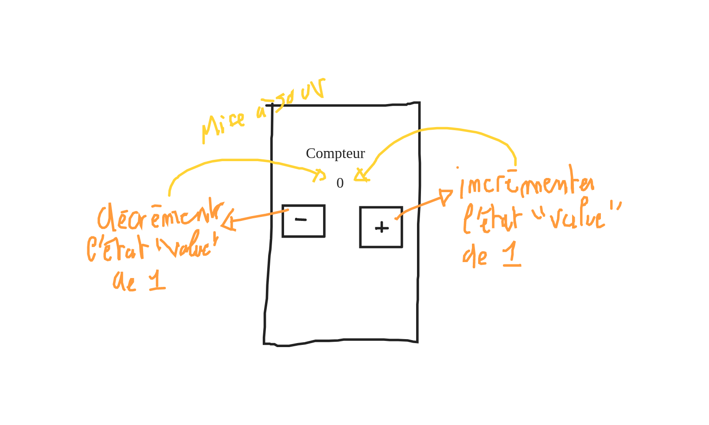

# Exercice : Créer un compteur intéractif

Le but est simple, créer une petite application qui permet d'augmenter ou de diminuer
un compteur.

## Mockup

## Le Composant et son style

Dans le répertoire `src/Component` créer un nouveau composant : `Counter`.

Dans le répertoire `src/Style` créer un nouveau style : `Counter`.

En vous inspirant du mockup plus haut, intégrer (designer) le petit compteur.

> Vous pouvez afficher le composant `Counter` dans le composant `App` pour qu'il
> soit visible.

## Les Actions (Event)

Attacher sur le bouton plus une fonction `onPlus` qui affiche dans le console `plus`.

Attacher sur le bouton moins une fonction `onMinux` qui affiche dans la console `moins`.

## Le state

En utilisant la fonction React `useState`, créer un état `counter` égale à 0 initialement.

Maintenant, faire en sorte d'augmenter de 1 cette état lorsque l'on clique sur `plus` et diminuer de 1 lorsque l'on clique sur le bouton moins.

> Cet état doit s'afficher à l'écran sous le titre "Compteur".
