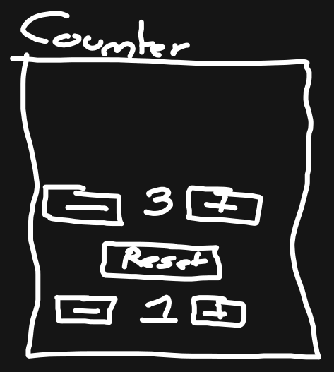

# Le Counter

Le but de l'exercice est de créer un petit coompteur interractif. Pour cela nous pouvons nous aider de **wireframe** :

## Wireframe :



## La mise en place

Dans votre applications react, suivez les bonnes pratiques et créé les fichiers suivants :

```
src/
  exo-counter/
    components/
      App.tsx
      Counter.tsx # Pas obligé ...
    styles/
      App.style.tsx
      Counter.style.tsx # Pas obligé ...
  main.tsx # Afficher le composant App
```

> Vous n'aurez qu'une fonction composant : le `Counter`, état et action ainsi que le JSX doivent se retrouver dans cette fonction

> N'hesitez pas à réaliser un schèma reactive avant de developper

> Utiliser `styled-components` dans un derniers temps pour styliser votre application ! Soyez créatif !
