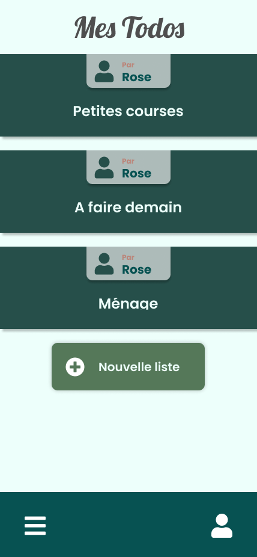

# Todo List : Page d'accueil

L'objectif de cet exercice est d'intégrer une petit page d'accueil de notre application de TodoList en utilisatn react native.

## Wireframe



## Organisation

1. Commencer par créer une nouvelle apllication react native (il faut faudra un téléphone connécté au même réseau que votre ordinateur et l'application expo sur votre téléphone).
2. Mettre en place la structure du projet :

```
app.json
App.tsx
src/
  components/
    Home.tsx
  styles/
    Home.style.tsx
  stores/
    Home.store.tsx
```

3. Vous pouvez installer styled-components :

```bash
$ npm i styled-components
$ npm i -D @types/styled-components @types/styled-components-react-native
```

4. Vous pouvez installer react router pour react native :

```bash
$ npm i react-router-native
```

> Attention le composant `BrowserRouter` il n'éxiste pas, c'est le `NativeRouter` qui le remplace
