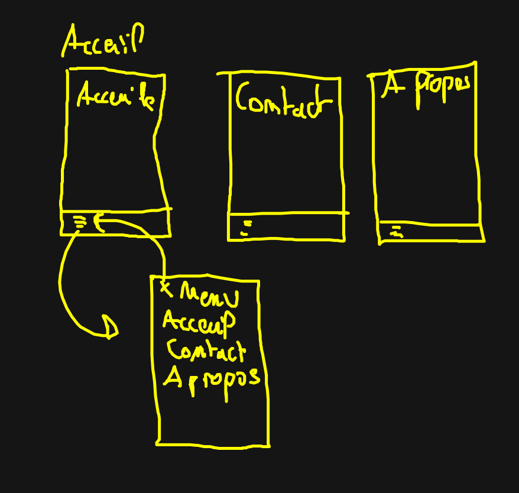

# Le menu et les pages

Le principe de l'exerice est simple, faire un menu dépliant et 3 écrans :)

## Wireframe



## L'organisation

Pour cette exercice, vous pouvez vous organiser comme ceci :

```
src/
  main.tsx
  exos-menu/
    components/
      App.tsx
      Menu.tsx
      Accueil.tsx
      Contact.tsx
      About.tsx
    styles/
      App.style.tsx
      Menu.style.tsx
      Accueil.style.tsx
      Contact.style.tsx
      About.style.tsx
```
