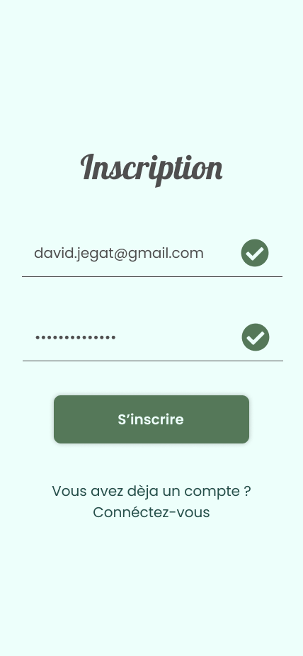

# TODO LIST : L'inscription

L'object de cet exercice est d'utiliser :

1. React
2. Styled Components
3. React Router
4. Nanostore

Afin de développer l'application suivante :

https://www.figma.com/file/bwQ0R9kNPCcCVPqpaySbpE/Todo-App?node-id=0%3A1&t=cbRxYmUjqOpfpAD7-1

## Etape 1 : L'inscription



- Commencer par mettre en place une nouvelle application toute neuve. Vous pouvez l'appeler « todo list »
- Installer les outils nescessaire pour développer l'application :

```bash
npm i react-router react-router-dom styled-components nanostores @nanostores/react
npm i -D @types/styled-components
```

- Mettre en place l'architecture :

```
src/
  main.tsx # fichier principal
  components/
    App.tsx
    Subscription.tsx
  styles/
    App.style.tsx
    Subscription.style.tsx
  stores/
    Subscription.store.tsx
```

- Sur une feuille de pappier réalisé un schèma reactif de l'écran d'inscription (noté les actions, l'états)

- Commencer par placer et afficher le composant s'inscription avec un HTML sommaire (pas de style) correspondant à l'écran.

- Réaliser dans le store, l'état et les actions du composant d'inscription

- Connéctez le store avec votre composant

- Placer le style !
