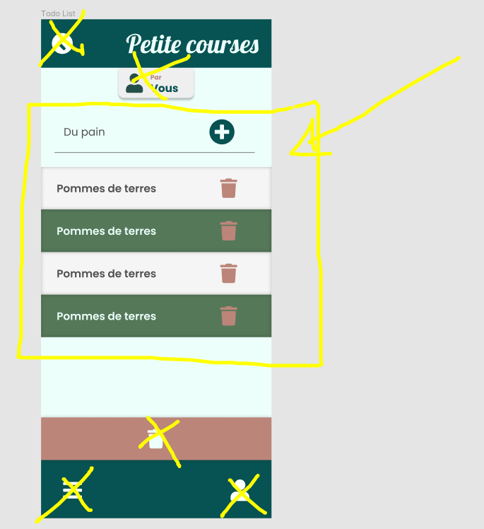

# La liste de chose à faire

L'objectif de l'exercice est réaliser l'écran suivant :

Dans cette écran nous pouvons :

1. Choisir une chose à en remplissant l'input tout en haut
2. Nous pouvons ajouter la chose à faire dans la liste en appuyant sur le bouton « + »
3. On peut cliquer sur un élément de la liste pour le rendre « terminé » (vert) ou « à faire » (blanc)
4. On peut cliquer sur supprimer pour détruire une chose à faire

Pour cette exercice il suffit de créer 3 fichiers :

`src/components/TodoList.tsx`
`src/stores/TodoList.stores.tsx`
`src/styles/TodoList.style.tsx`
